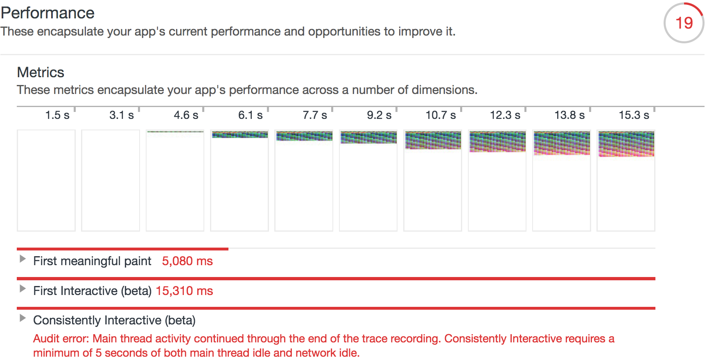
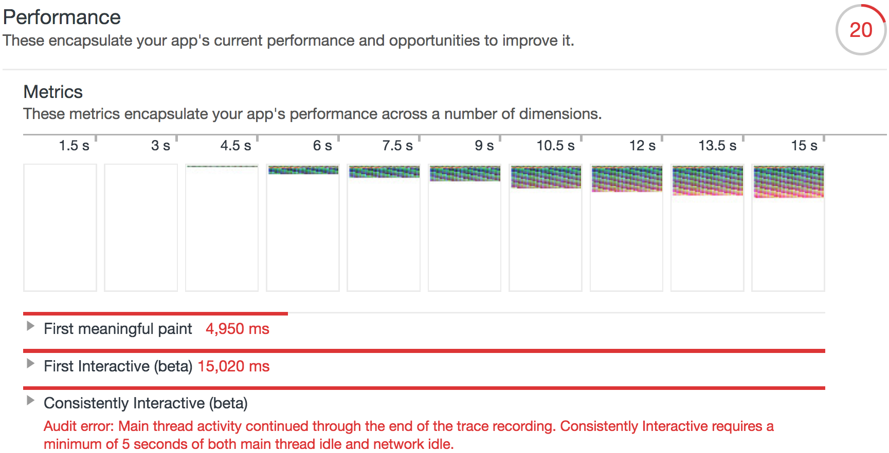
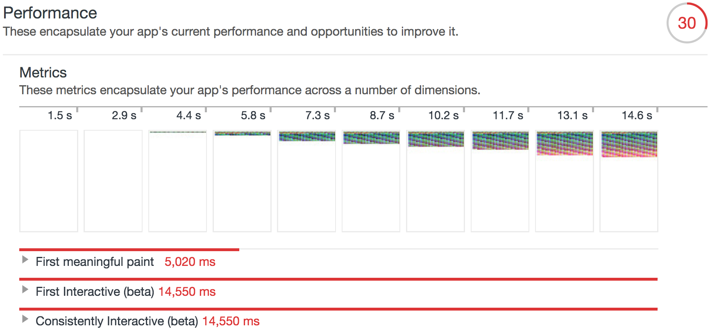

# Benchmark

The benchmark basically compares three servers.
  * NodeJS (without streaming) - base case
  * Marinate for NodeJS (without streaming) - this is to find overheard of using marinate
  * Marinate for NodeJS (with streaming) - this is to see how well streaming performs.

The benchmark uses a test website created in [CSS Streaming](https://github.com/samccone/streaming-css).
This is no way close to a normal web app, however it is a good site to see benefits of streaming of CSS and HTML.

# Results

We performed LightHouse audit on these three servers.

| Case | Audit Result |
|:--|:--|
| Base Case |  |
| Marinate w/o Streaming  | 
| Marinate w/ Streaming | 

| Case | First Meaning Paint |  First Interactive
|:--|:--|:--|
| Base Case | 5080 ms |  15,310 ms
| Marinate w/o Streaming | 4950 ms | 15,020 ms
| Marinate w/ Streaming | 5020 ms | 14,550 ms

